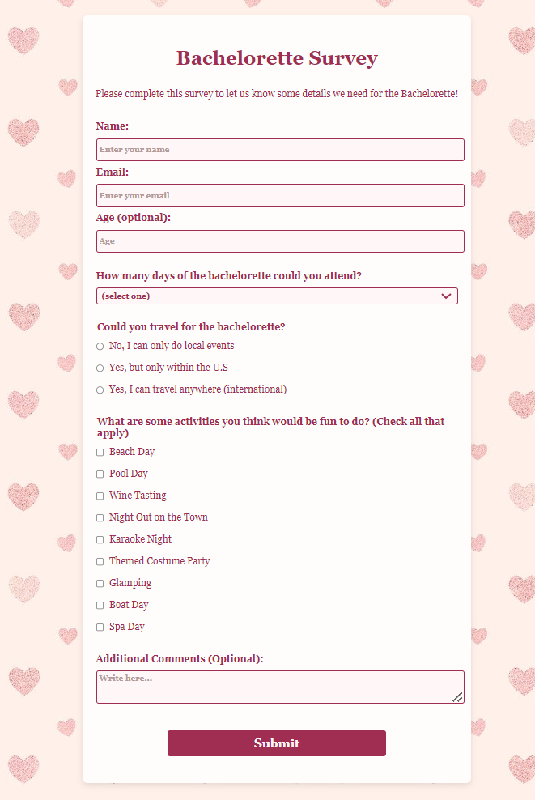

# Survey Form
A responsive survey form created independently using HTML and CSS, following guidelines from the FreeCodeCamp Responsive Web Design certification course.

## Description

This project showcases a survey form with various input fields, including text, email, age, dropdowns, radio buttons, checkboxes, and a textarea for additional comments. Created as part of the FreeCodeCamp curriculum, I completed this project by following specific guidelines while applying my own design choices. It serves as a fun and engaging way to collect information from bridesmaids regarding their participation in the bachelorette.

## Features

- Responsive design that adapts to different screen sizes.
- Input fields for name, email, and age (optional).
- Dropdown menu to select attendance duration.
- Radio buttons to indicate travel availability.
- Checkboxes for preferred activities.
- Textarea for additional comments.

## Technologies Used

- HTML
- CSS

## How to Run

1. Clone the repository to your local machine.
2. Open `index.html` in your web browser.

## Acknowledgments

This project was completed as part of the FreeCodeCamp Responsive Web Design certification course. Special thanks to FreeCodeCamp for providing the resources and guidance.
